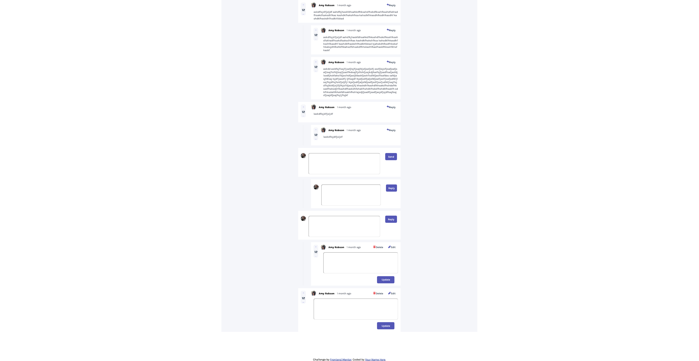

# Frontend Mentor - Interactive comments section solution

This is a solution to the [Interactive comments section challenge on Frontend Mentor](https://www.frontendmentor.io/challenges/interactive-comments-section-iG1RugEG9). Frontend Mentor challenges help you improve your coding skills by building realistic projects. 

## Table of contents

- [Overview](#overview)
  - [The challenge](#the-challenge)
  - [Screenshot](#screenshot)
  - [Links](#links)
- [My process](#my-process)
  - [Built with](#built-with)
  - [What I learned](#what-i-learned)
  - [Continued development](#continued-development)
  - [Useful resources](#useful-resources)
- [Author](#author)
- [Acknowledgments](#acknowledgments)

**Note: Delete this note and update the table of contents based on what sections you keep.**

## Overview

### The challenge

Users should be able to:

- View the optimal layout for the app depending on their device's screen size
- See hover states for all interactive elements on the page
- Create, Read, Update, and Delete comments and replies
- Upvote and downvote comments
- **Bonus**: If you're building a purely front-end project, use `localStorage` to save the current state in the browser that persists when the browser is refreshed.
- **Bonus**: Instead of using the `createdAt` strings from the `data.json` file, try using timestamps and dynamically track the time since the comment or reply was posted.

### Screenshot



### Links

- Solution URL: [Add solution URL here](https://your-solution-url.com)
- Live Site URL: [https://optimistic-mccarthy-e0dba9.netlify.app/](https://optimistic-mccarthy-e0dba9.netlify.app/)

## My process

### Built with

- Semantic HTML5 markup
- CSS custom properties
- Flexbox

### What I learned

1. To vertical line which extends with adding new replies using height = fit-content to parent class.

```html
   <hr class="vertical">
```
```css


.reply_box {
    width: 35rem;
    height: fit-content;
    background-color: var(--neutral-White);
    display: flex;
    flex-direction: row;
}

.vertical {
    width: 0rem;
    border: none;
    border-left: 0.2rem solid var(--neutral-Light-gray);
}

```

2. The more complex structure the more CSS needs to modularised


3. While using templates, try querySelector to get parent class of template and appendChild. Since Templates have unique classes.

4. Use Map of array functions as possible.


### Continued development

1. Layout is done which extends with new replies and new comments. Need to add User Comment.

## Author

- Website - [nikeshnaik.dev](https://nikeshnaik.dev)
- Frontend Mentor - [@nikeshnaik](https://www.frontendmentor.io/profile/nikeshnnaik)
- Twitter - [@nikeshinfinity](https://www.twitter.com/nikeshinfinity)
